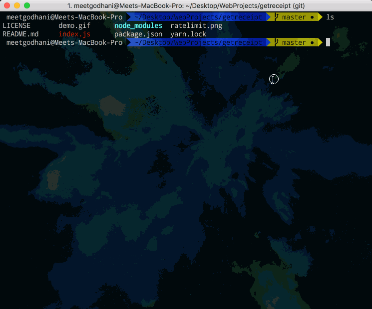
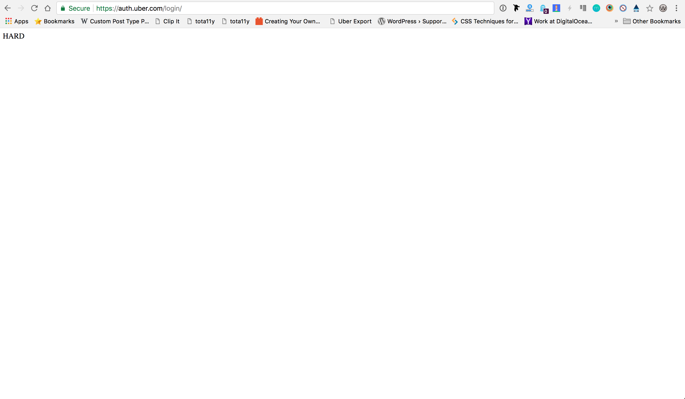

# Get Receipt #

Get receipt is an command line application made using [Google Puppeteer](https://github.com/GoogleChrome/puppeteer), a headless chrome node library mainly used for web scraping and browser automation.

- Problem
<Enter Description>

- Solution
<Enter Description>


## Demo



## Getting Started

Before we start , we need following below tools installed. Head over to their websites and install them.

- [Node 8.+](https://nodejs.org)

## Usage

```
git clone https://mgodhani@bitbucket.org/breakenter/getreceipt.git

cd getreceipt

npm -g install

```
After running commands above, run following below:
```
get-receipt

```


## Note

This project does not store any kind of data anywhere. It is a project without any database involved.

## Caution

- Since this program scrapes website. You might be halted by Uber's rate limiting. Try to use command line app with having a good amount of idle time gap.



### Authors & Contributors

- Meet Godhani
- Adi Ofir

### License

[MIT License](LICENSE)
