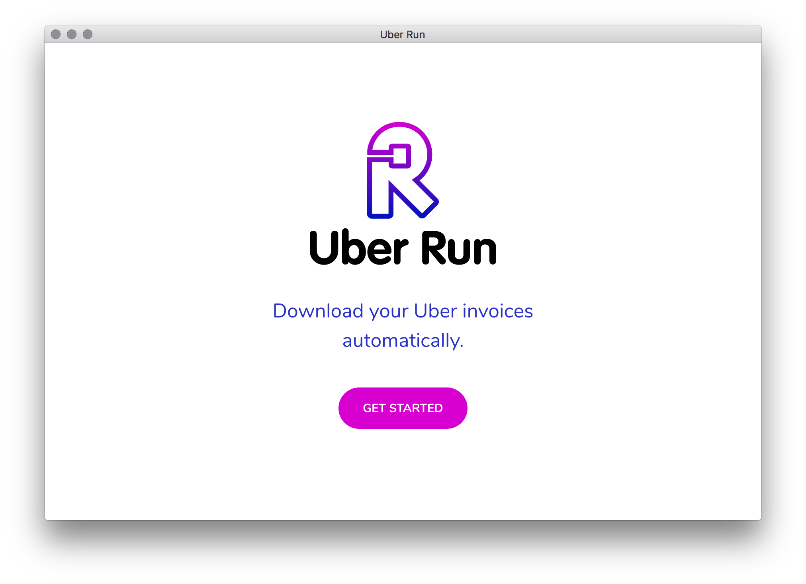

<p align="center">

</p>

<p align="center">
<a href="https://codeclimate.com/github/break-enter/uberrun/maintainability"></a>
</p>

> Simple automation desktop app to download all invoices from Uber and save it in folder.

#### Build Setup

``` bash
# install dependencies
npm install

# serve with hot reload at localhost:9080
npm run dev

# build electron application for production
npm run build


# lint all JS/Vue component files in `src/`
npm run lint

```

#### Credits

Adi Ofr ([@breakenterTo](https://twitter.com/breakenterTo)) for Logo and all design related contributions.
